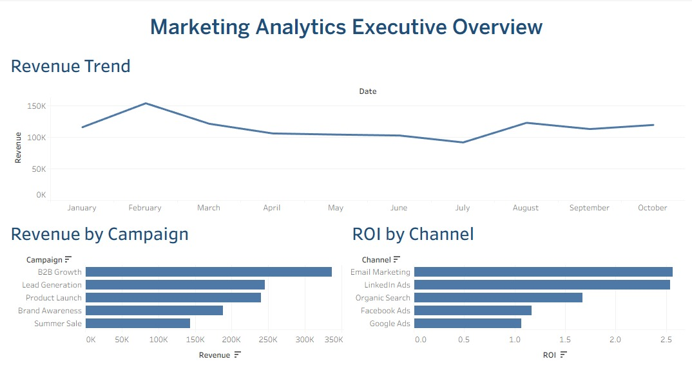
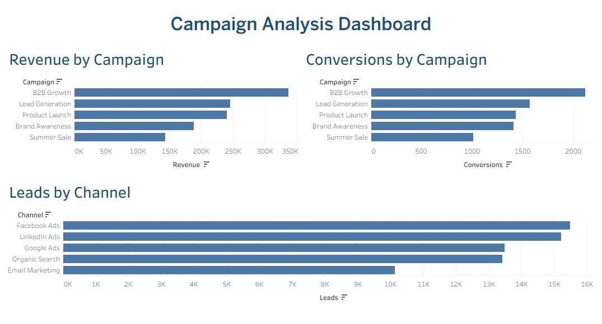

# 📊 Marketing Analytics Dashboard


## 📌 Project Overview

This project presents an interactive Tableau dashboard designed to analyze marketing campaign performance and support data-driven decision-making.

The solution provides insights into revenue trends, campaign effectiveness, lead generation, conversions, and channel return on investment (ROI).

---

## 🎯 Business Problem

Marketing teams need a clear and centralized view of campaign performance to understand which initiatives generate the highest revenue, conversions, and return on investment.

Without a consolidated dashboard, decision-making becomes slower and less efficient.

---

## ❓ Business Questions

The dashboard was designed to answer the following questions:

- How is revenue evolving over time?
- Which campaigns generate the highest revenue?
- Which marketing channels deliver the best ROI?
- Which campaigns generate the most conversions?
- Which channels generate the highest number of leads?

---

## 🔗 Tableau Public Dashboards

### Executive Overview
Tableau Public:
[Executive Overview](https://public.tableau.com/app/profile/marcos.rogerio5761/viz/Marketing_Analytics_Dashboard_17830061821090/ExecutiveOverview)

### Campaign Analysis
Tableau Public:
[Campaign Analysis](https://public.tableau.com/app/profile/marcos.rogerio5761/viz/Marketing_Analytics_Campaign_Analysis/CampaignAnalysis)

---

## 📊 Dashboard Preview

### Executive Overview



### Campaign Analysis



---

## 🛠 Technologies Used

- Tableau Public
- Microsoft Excel / CSV
- Data Visualization
- Business Intelligence
- Marketing Analytics

---

## 📂 Repository Structure

```text
Marketing-Analytics-Dashboard
│
├── Data
│   └── marketing_data.csv
│
├── Images
│   ├── executive_overview.png
│   └── campaign_analysis.png
│
├── Tableau
│   └── Marketing_Analytics_Dashboard.twbx
│
└── README.md
```

---

## 📈 Key Insights

- B2B Growth generated the highest revenue among campaigns.
- Email Marketing delivered the strongest ROI.
- Facebook Ads generated the highest number of leads.
- Revenue remained relatively stable throughout the analyzed period.
- Campaign performance varies significantly across channels.

---

## 🎓 What I Learned

Through this project, I developed practical experience in:

- Building interactive dashboards in Tableau
- Marketing performance analysis
- Data storytelling
- Dashboard design and layout
- Publishing projects on Tableau Public
- Creating professional portfolio projects

---

## 👨🏾‍💻 Author

**Marcos Rogério da Silva**

Trade Marketing | Merchandising | Business Intelligence | Data Analytics

### Connect with me

- GitHub: https://github.com/marcosrdevbr
- LinkedIn: https://www.linkedin.com/in/marcos-rogerio-017923302/
- Tableau: https://public.tableau.com/app/profile/marcos.rogerio5761/vizzes

Feel free to connect or share feedback about this project.

---

## ⭐ If you found this project interesting

If you enjoyed this project or found it useful, feel free to connect with me on LinkedIn or explore my other repositories on GitHub.

Thank you for visiting my portfolio!
